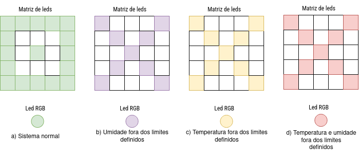

<h1>Estação meteorológica inteligente</h1>

<h3 align="center">Desenvolvimento de uma plataforma de sensoriamento climático com gerenciamento via interface web</h3>

Este projeto consiste em uma estação meteorológica inteligente capaz de coletar, processar e exibir dados climáticos em tempo real. A 
plataforma permite o monitoramento remoto dos sensores e o gerenciamento de parâmetros por meio de uma interface web intuitiva. O projeto foi desenvolvido 
utilizando a plataforma BitDogLab.

## 🌦️ Sobre o projeto

Este projeto buscou implementar uma estação meteorológica inteligente a fim de monitorar condições climáticas em regioẽs específicas e emitir alertas em casos de 
situações críticas. Por meio da interface web do sistema, é possível acompanhar em tempo real a temperatura, a umidade relativa do ar e a altitude do local. Além 
disso, o usuário pode definir dinamicamente limites  mínimos e máximos para temperatura e umidade, além de offsets de calibração para os mesmos. O sistema 
apresenta ainda sinalizações visuais e exibição de informações in loco.

O sistema foi desenvolvido utilizando os sensores AHT20+BMP280 e a plataforma de desenvolvomento BiDogLab.

## ⚙️ Funcionalidades 

- **Monitoramento em tempo real** de temperatura, umidade relativa do ar e altitude.
- **Alertas visuais** automáticos para condições climáticas críticas.
- Exibição local dos dados coletados.
- **Configuração dinâmica** de limites mínimos e máximos para temperatura e umidade via interface web.
- Calibração dos sensores por meio de **offsets ajustáveis na interface web**.
- Visualização em tempo real de dados e alertas diretamente na interface web.
- Acesso ao **histórico dos dados coletados** pela interface web.
- Interface web intuitiva, **responsiva** e de fácil navegação.

    
<strong style="font-size:1.3em;">🛠️ Hardware utilizado</strong>

- Sensor de temperatura, umidade e pressão barométrica AHT20+BMP280 → interface I2C0
- Matriz de leds WS2812 → GPIO 7
- LED RGB → GPIO 11, 12 e 13
- Display OLED → interface I2C1
- Pushbutton → GPIO 5

    
<strong style="font-size:1.3em;">💡 Sinalização visual</strong>

    
<strong style="font-size:1.3em;">📝 Tasks FreeRTOS</strong>

| Tarefa             | Descrição                                                                                                 |
|--------------------|----------------------------------------------------------------------------------------------------------|
| **vTaskTCPServer**     | Responsável pelo processamento dos eventos do servidor TCP, gerenciando conexões e transferências de dados.      |
| **vTaskLedMtx**        | Gerencia as sinalizações visuais (matriz de LEDs e LED RGB), a partir do código de erro do sistema.              |
| **vTaskDisplay**       | Gerencia a exibição das informações no display OLED.                                                            |
| **vTaskSensorPolling** | Realiza o polling dos sensores AHT20 e BMP280 e gerencia o código de erro do sistema.                           |
| **vTaskUpdateParam**   | Executa as atualizações de parâmetros recebidos da interface web.                                               |

    
<strong style="font-size:1.3em;">🔗 Requisições AJAX</strong>

1. */station/data*: requisição do tipo GET para obter os dados atuais do sistema (temperatura, umidade, altitude, limites, offset e código de erro);
2. */limits/temp*: requisição do tipo POST para atualizar os limites de operação de temperatura;
3. */limits/hum*: requisição do tipo POST para atualizar os limites de operação de umidade;
4. */offset/temp*: requisição do tipo POST para atualizar o offset de temperatura;
5. */offset/hum*: requisição do tipo POST para atualizar o offset de umidade;

